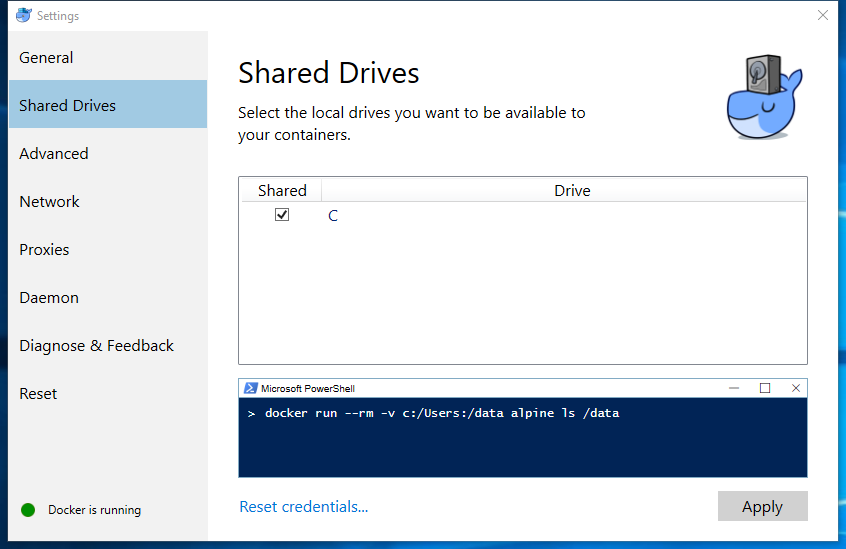
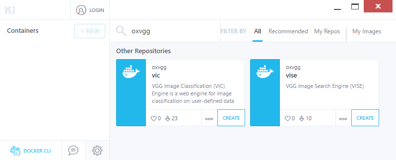
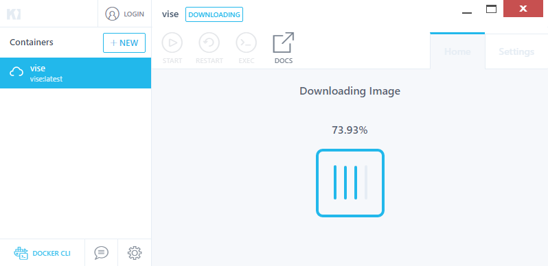
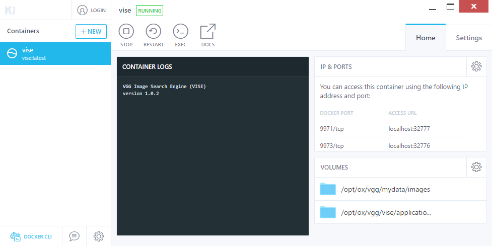
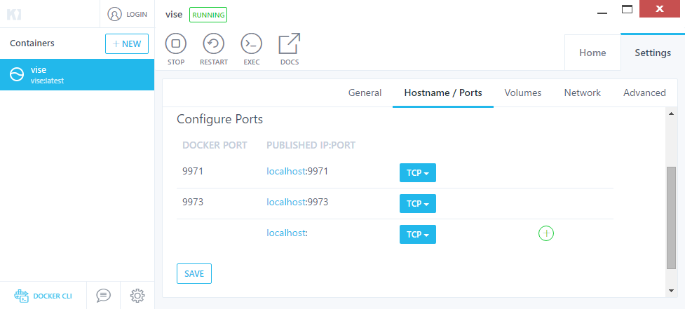
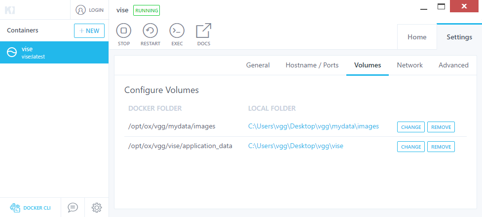
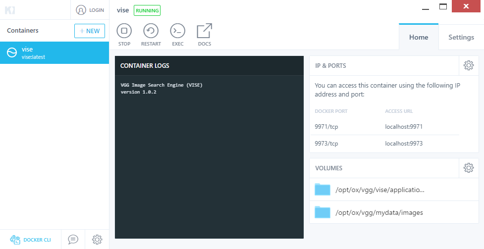

# VISE Installation Instructions for Windows 10

### Step 1 : Install Docker
 Download [Docker-CE for Windows](https://store.docker.com/editions/community/docker-ce-desktop-windows) 
 and install the docker application just like you install any other Windows 
 application. The [installation instructions](https://docs.docker.com/docker-for-windows/) 
 guide at docker website provides more details about the installation process.
 
 The VISE docker image has been built using **docker version 17.06.0**. 
 Please ensure that you install the same (or superior) version of docker in your 
 computer.
 
 The VISE application requires access to your local disk to store application 
 data and load the training images. Start docker, open docker settings and in "Shared Drives" 
 menu, select "C" (or any other drive) as shown below:
 
 
 
### Step 2 : Install and Open Kitematic
 [Kitematic](https://kitematic.com/) is a tool that provides a graphical user 
 interface to load, start, stop and configure docker containers. [Download and 
 install](https://www.docker.com/products/docker-toolbox) this tool.
 
 Once this tool is installed, double click the Kitematic icon in Desktop to run 
 this tool.

### Step 3 : Install oxvgg/vise
 In the Kitematic tool, enter **oxvgg** in the search toolbar. This will 
 show all the docker containers released by the Visual Geometry Group (VGG) as 
 shown below:
 
 
 
 Click **Create** button in the bottom right corner of the box panel corresponding 
 to VISE. This will start download of the VISE container (may take few minutes).
 
 
 
 After the download is complete, the VISE container will start automatically as 
 shown below :
 
 
 
### Step 4 : Configure ports and volume
Ensure that VISE container is running (*RUNNING* will appear in the top side of 
kitematic window, if not, press the *START* button). Click **Settings** (near 
top-right corner) and click on **Hostname / Ports** tab to show the port 
configuration panel. Edit and **Save** the published port so that the docker 
port `9971` maps to `localhost:9971` and port `9973` maps to `localhost:9973`.
Don't forget to press **Save** after you update the ports.

 
 
Click the **Volumes** panel to show the Configure Volumes panel. The VISE 
application uses the following two folders:
 * `/opt/ox/vgg/vise/application_data` : This is the folder where VISE stores all its internal application files
 * `/opt/ox/vgg/mydata/images` : This is the folder where user will be asked to copy their personal images that needs to be indexed and made searchable

As a user, you can map these docker folders to any local folder in your computer.
For this guide, we assume that you configure volumes as shown below:

 

### Step 5 : Run oxvgg/vise
Press **Stop** followed by **Start** to restart the container. Now visit 
[http://localhost:9971](http://localhost:9971) in you web browser and follow 
the [User Guide](UserGuide.md) to train VISE for searching your own image collections.

Ensure that your Kitematic tool shows something similar to the screenshot below:

 

### Step 6 : Stopping oxvgg/vise
In the Kitematic tool, click on **oxvgg/vise** on left hand side panel and 
press **Stop** button to stop the VISE container.
