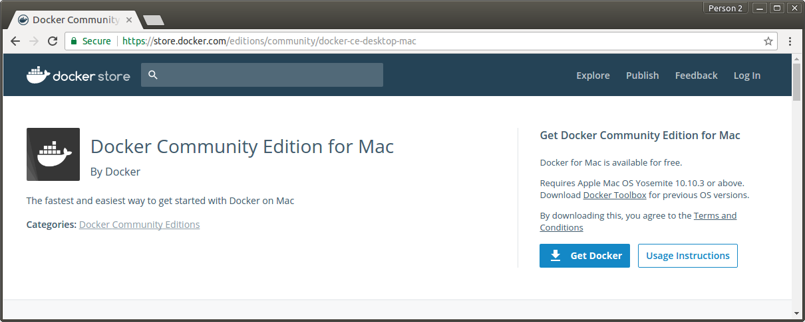
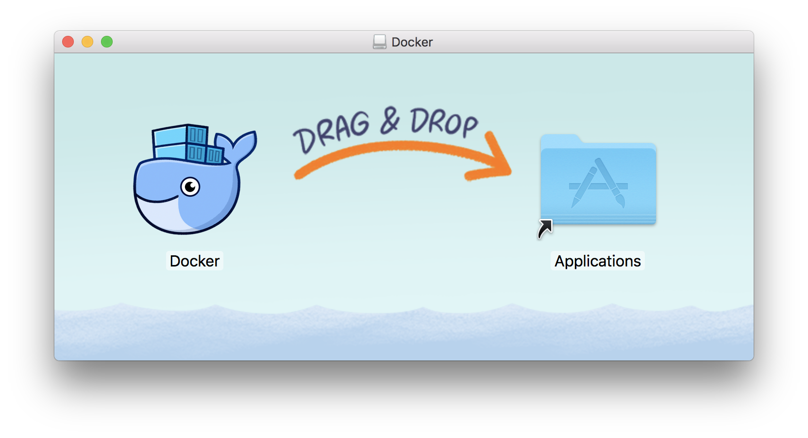
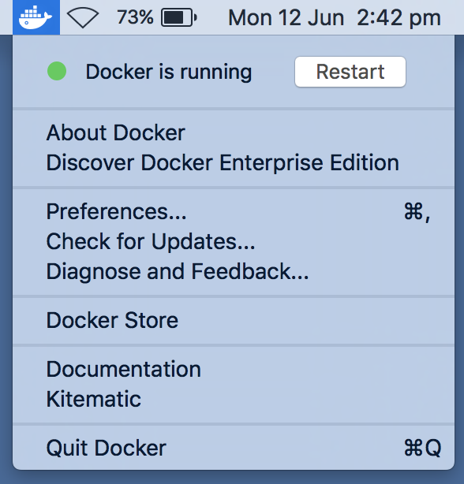

# Installation
VISE can be installed in two ways:
 * [Docker image](#docker-based-installation)
   * [Ubuntu](#ubuntu)
   * [MacOS](#macos)
 * [Source code](#compiling-from-source-code)
   * Coming soon. Meanwhile, you can look at the [dockerfile](https://gitlab.com/vgg/vise/blob/master/dist/docker/Dockerfile) for some inspiration.

For users without prior knowledge of compiling and installing libraries, we recommend the Docker image based method while 
for more advanced users, we advise to compile VISE from source code.

## Docker based installation
   * There is no need to install or compile any libraries. All the dependencies come pre-installed and pre-compiled.
   * This method requires running docker (and hence VISE) as root (i.e. Administration) which may not be safe.

### Ubuntu
 1. Install docker : based on instructions at [docker website](https://docs.docker.com/engine/installation/linux/ubuntu/#install-using-the-repository)
```
sudo apt-get remove docker docker-engine
sudo apt autoremove
sudo apt-get install     apt-transport-https     ca-certificates     curl     software-properties-common
curl -fsSL https://download.docker.com/linux/ubuntu/gpg | sudo apt-key add -
sudo apt-key fingerprint 0EBFCD88
sudo add-apt-repository    "deb [arch=amd64] https://download.docker.com/linux/ubuntu (lsb_release -cs) stable"
sudo apt-get update
apt-cache madison docker-ce
sudo apt-get install docker-ce=17.03.0~ce-0~ubuntu-xenial
```

 2. Download and extract VISE archive from http://www.robots.ox.ac.uk/~vgg/software/vise/downloads/docker/vise_docker-1.0.0.zip
```
wget http://www.robots.ox.ac.uk/~vgg/software/vise/downloads/docker/vise_docker-1.0.0.zip
unzip vise_docker-1.0.0.zip
cd vise_docker-1.0.0/
```
Now, execute the following scripts to run VISE:
```
./linux_load.sh  # load VISE docker image (first time only)
./linux_start.sh # to start the docker container
./linux_stop.sh  # to stop container (do not forget)
```

### MacOS
 * Install docker




 * Download and extract VISE archive from http://www.robots.ox.ac.uk/~vgg/software/vise/downloads/docker/vise_docker-1.0.0.zip
 


 * The following scripts are provided:
  * Click `macos_load.command` (only the first time) script to load the VISE image container
  * Click `macos_start.command` to start the VISE (or, Image Matcher) tool
  * Click `macos_stop.command` to stop it (do not forget)


## Compiling from source code
 * This method requires user to compile and install all the dependant libraries (Boost, Imagemagick, cmake, fastann)
 * The compiled VISE binaries can be executed by any user (i.e. non Administrative account) and hence is safer.


Abhishek Dutta  
14 June 2017
